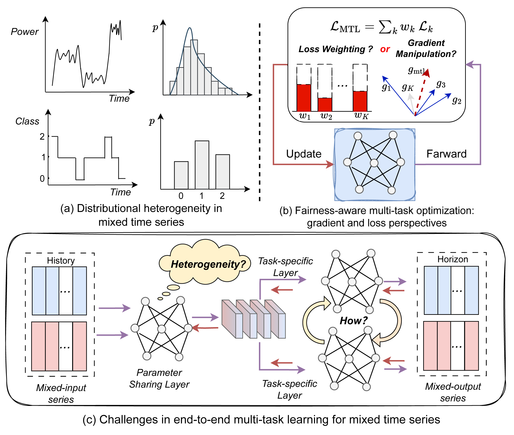

# Mixed time series pattern learning for multi-task wind power and ramp event forecasting

## Abstract
Within the field of wind energy prediction, existing studies mainly focus on modeling continuous-variable time series such as wind power, while often overlooking discrete-variable time series that represent ramp event states. Yet in wind power systems, mixed time series comprising continuous and discrete variables are in fact widespread. Integrating these heterogeneous spatiotemporal modalities across wind farms remains challenging due to distributional heterogeneity and the difficulty of extracting categorical temporal features. To address these challenges, this paper proposes MixForecastor, a unified multi-task learning framework for mixed time series forecasting, where both inputs and outputs comprise continuous and discrete variables. The model jointly predicts wind power and ramp event risks by fusing heterogeneous inputs within a shared representation space, which is implemented via a novel heterogeneous fusion module. In addition, the model incorporates a new difference-aware auxiliary module that reinforces the coupling between power variations and ramp dynamics. To handle severe class imbalance and ensure task fairness, MixForecastor is driven by a customized bi-level optimization strategy, wherein a multi-objective imbalance controller dynamically selects optimal strategies for each wind farm, and a fairness-aware multi-task optimizer mitigates conflicts between tasks. Extensive experiments on real-world wind power datasets demonstrate that MixForecastor achieves superior performance in forecasting both continuous power outputs and discrete ramp event states, providing a modeling framework that broadens the scope beyond traditional inputs based on continuous-variable time series.

<p align="center"> 
    
</p>


## Project Structure

```bash
├── dataset/                   # Dataset files
│   ├── NSW1_30min_labeled_dataset.csv

├── data_provider/             # Data loading and preprocessing
│   ├── ramp_data_factory.py
│   ├── ramp_data_loader.py
│   ├── ...
├── exp/                       # Experiment scripts
│   ├── exp_basic.py
│   ├── exp_ramp_normal.py      # Mixed time series (without addressing heterogeneity)
│   ├── exp_ramp_normalS.py     # Single-task learning
│   └── exp_ramp_normalM.py     # Multi-task learning

├── layers/                     # Model layer definitions
│   ├── ASHLayer.py
│   ├── AutoCorrelation.py
│   ├── Autoformer_EncDec.py
│   ├── Conv_Blocks.py
│   ├── Crossformer_EncDec.py
│   └── ... 

├── models/                     # Forecasting model architectures
│   ├── Multi_task.py           # Multi-task model
│   ├── Singel.py               # Single-task model
│   └── Multi_taskm.py          # Mixed time series (without addressing heterogeneity)
│   └── ...

├── pic/                        # Visualization
│   └── MixForecastor.png

├── scripts/                    # Experiment execution scripts
│   ├── TEST.sh

├── test_results/               # Experiment execution scripts
│   ├── Program 1
│   ├── Program 2
│   ├── ...

├── utils/                      # Utilities
│   ├── ADFtest.py
│   ├── augmentation.py
│   ├── dtw.py
│   ├── dtw_metric.py
│   ├── Famo.py
│   └── methods/
│       ├── min_norm_solvers.py
│       ├── testing.py
│       └── weight_methods.py

├── result.txt  # result
├── environment.yml                # Conda environment dependencies
├── run_ramp.py                    # Main program
└── README.md
```

## ⚠️ Note to Users

We welcome open-source contributions and hope this code benefits the community. However, to protect our key innovations, the core components of our approach are not yet publicly available.

This version of the code allows you to run three types of experiments and includes a dataset for testing:

1. **Single-Task Learning** ([`exp_ramp_normalS.py`](./exp/exp_ramp_normalS.py))
2. **Multi-Task Learning** ([`exp_ramp_normalM.py`](./exp/exp_ramp_normalM.py))
3. **Simple Mixed Sequence Modeling (MixRamp)** ([`exp_ramp_normal.py`](./exp/exp_ramp_normal.py))

From these experiments, two important observations emerge:

1. In regression and classification tasks, Single-Task Learning is less effective than Multi-Task Learning. Even with PCGrad, standard Multi-Task Learning struggles to handle task conflicts.
2. Multi-Task Learning performs better than simple mixed sequence modeling (MixRamp) on regression tasks but underperforms on classification tasks. This highlights the need for mixed sequence modeling. However, MixRamp does not address heterogeneity, which motivates the development of **MixForecastor**, our main contribution.


These results demonstrate the necessity of our work. The detailed prediction results are available in the [`test_results/`](./test_results) folder. You can find the final evaluation metrics in [`result.txt`](./result.txt) and the training logs in [`test.log`](./test.log).


##  Quick Start

### 1. Setup Environment
```bash
conda env create -f environment.yml
conda activate TSL
```

### 2. Run Experiments
```bash
bash ./scripts/TEST.sh
```
## ‼️ **Important:**
We plan to release the full version of the code in the future with all core functionalities and modules. Stay tuned for updates! 🚀
